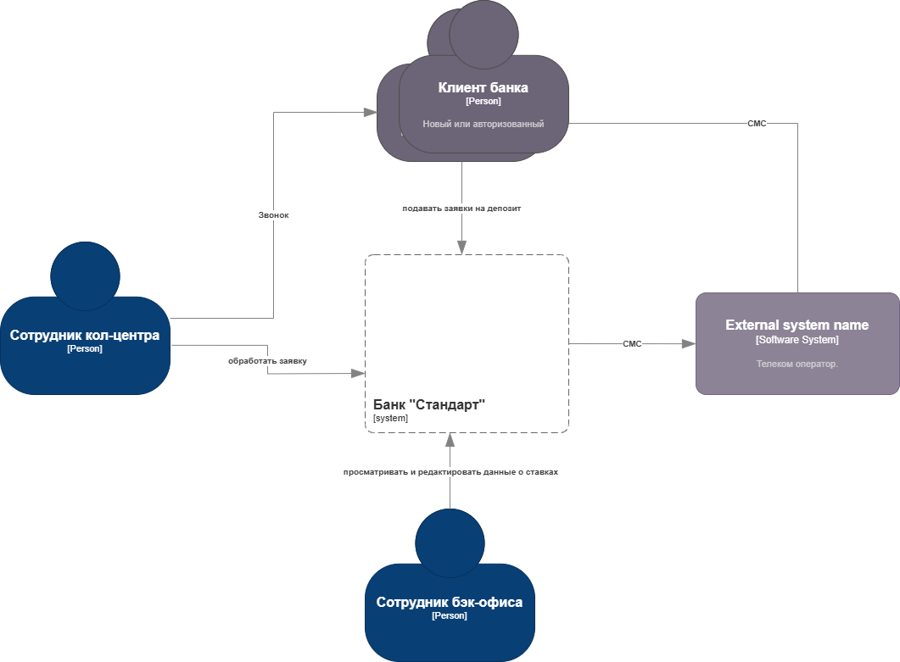
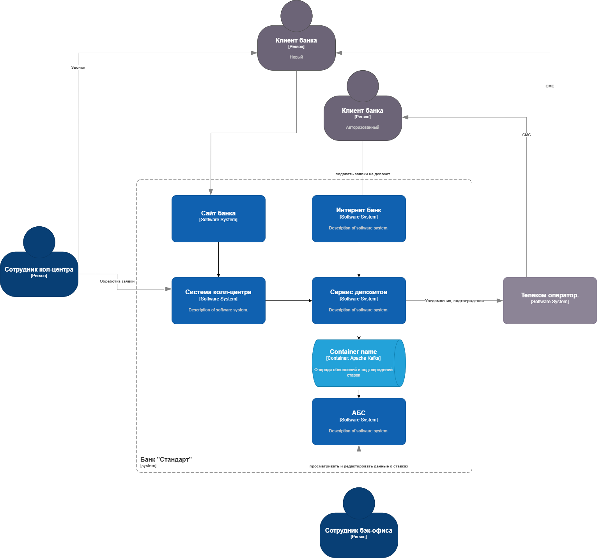

### **Название задачи:** 
Открытие депозитов для MVP
### **Автор:**
Архитектор М.
### **Дата:**
2025-06-19
### **Функциональные требования**

|**№**|**Действующие лица или системы**|**Use Case**|**Описание**|
|---|---|---|---|
| 1. | Клиент, Cайт | Заявка на депозит | 1. На сайте новый клиент видит список доступных депозитов с актуальными ставками; 2. Клиент подаёт заявку на депозит, оставив свой номер телефона и Ф. И. О.; 3. Заявка попадает в систему кол-центра.|
| 2. | Кол-центр, Клиент | Обработка заявки | 1. Изучив заявку в системе кол-центра, менеджер может предложить особые условия.; 2. Менеджер кол-центра звонит  клиенту;|
| 3. | Авторизованный клиент, Интернет-банк | Открытие депозита | 1. Клиент видит список доступных депозитов с актуальными ставками и персонализированные ставки лично для него 2. Клиент указывает счёт, продукт и сумму депозита, подаёт заявку на открытие депозита; 3. Клиент подтверждает операцию с помощью СМС-кода.|
| 4. | Менеджер бэк-офиса | Подтверждение условий депозита | 1. Менеджер проверяет ставку и заявку в АБС; 2. Подтверждает оформление. |
| 5. | Бэк-офис (кредитный отдел) | Работа со ставками | Сотрудники обновляют ставки в XLS или в централизованной системе хранения ставок. |

### **Нефункциональные требования**

|**№**|**Требование**|
|---|---|
| R   | **Надёжность (Reliability)**  |
| R1  | Система должна быть доступна 99.9% времени |
| R2  | В случае сбоя в основном ЦОДе система должна автоматически переключиться на резервный |
| R3  | Система не должна зависеть напрямую от АБС при обработке заявок через интернет-банк |
| P   | **Производительность (Performance)** |
| P1  | Отклик системы должен быть меньше 500 мс для 90% операций |
| P2  | Загрузка справочных данных не должна занимать более секунды для 90% операций|
| S   | **Поддерживаемость (Supportability)** |
| S1  | Необходимо разработать документацию для дальнейшего расширения функционала |
| S2  | Предпочтительно использовать существующие технологии банка (MS SQL, Oracle) |
| S3  | Новые технологии должны быть совместимы с текущими платформами |
| S4  | Желательно, чтобы сотрудники уже имели экспертизу в новых технологиях |
| +R  | **+ Ограничения (Restrictions)**  |
| +R1 | Передача чувствительной информации должна осуществляться с использованием шифрования трафика |
| +R2 | Реализация СМС-подтверждений должна быть выполнена силами команды банка, а не доработкой ядра |
| +R3 | Ставки по депозитам должны храниться в АБС или другой централизованной системе, а не в XLS-файлах |
| +R5 | При необходимости очередей сообщений предпочтение отдаётся Apache Kafka |
| +R6 | Интернет-банк пока несовместим с Kafka, поэтому нужно предусмотреть промежуточный слой или временное решение |
| +R7 | Функционал MVP должен быть реализован без прямого взаимодействия интернет-банка с API АБС |
| +R8 | На этапе MVP заявку обрабатывает менеджер бэк-офиса вручную |                  |
| +R9 | Система должна поддерживать горизонтальное масштабирование и равномерное распределение нагрузки |
| +R10 | АБС может масштабироваться только вертикально из-за ограничений БД |     Сервер должен иметь низкую утилизацию (<40% для CPU и RAM) в обычные рабочие часы, чтобы иметь возможность преоддолеть непредсказуемые короткие пики нагрузок.        |
| +R11 | Интернет-банк работает в одном ЦОД, но есть возможность переключения на резервный |

|||
### **Решение**
Диаграмма контекста:

Диаграмма контейнеров:

Необходимо ввести новый сервис для работы с депозитами, он сможет экранировать АБС от излишних нагрузок, за счёт кеширования данных и работы через очереди. Кроме того в нём сразу можно заложить возможность горизонтального масштабирования.
Это закроет требования +R3, +R6, +R7, +R9.
Для поддержки очередей выбран Apache Kafka: +R5

### **Альтернативы**
Можно установить АБС на очень мощный сервер с большим количеством CPU и RAM. Это будет дорого и не гарантирует повторения проблем в будущем, когда количество клиентов банка сильно вырасте.

**Недостатки, ограничения, риски**

- На начальном этапе реализации MVP заявки обрабатываются вручную, что ограничивает уровень автоматизации.
- Ручное выполнение операций может привести к задержкам в обработке клиентских запросов, особенно если количество клиентов начнёт расти.
- Для обеспечения безопасности необходимо шифровать передачу персональных данных и другой конфиденциальной информации.
- В случае отсутствия готового резервного центра обработки данных или его неполной функциональности теряется отказоустойчивость системы.
- С увеличением числа клиентов могут возникнуть сложности с производительностью сайта банка.

