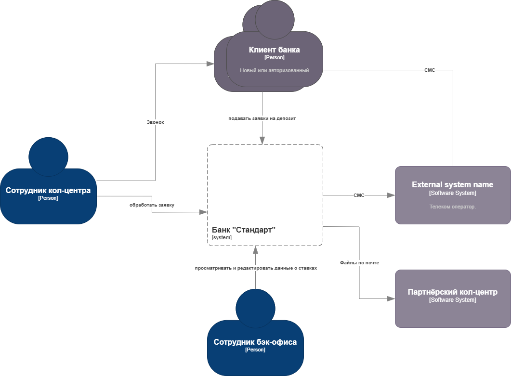
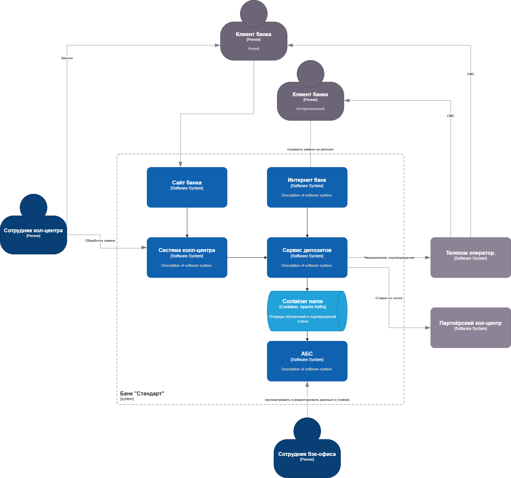

### **Название задачи:** 
Передача ставок в партнёрский кол-центр
### **Автор:**
Архитектор М.
### **Дата:**
2025-06-20
### **Функциональные требования**

|**№**|**Действующие лица или системы**|**Use Case**|**Описание**|
| :-: | :- | :- | :- |
| 1.  | Партнёрский кол-центр, система банка| Партнёр долже получать актуальные ставки в виде файлов | ОСистема банка отправляет файл по почте|
### **Нефункциональные требования**
|**№**|**Требование**|
| :-: | :- |
| R21 | Передача файлов с данными в партнёрский кол-центр должна происходить надёжно и гарантировать доставку. |
| R22 | Сбой в передаче данных не должен приводить к недоступности информации у сотрудников кол-центров. |
| R23 | Обновление ставок в системе кол-центра должно происходить оперативно, чтобы информация оставалась актуальной. |

### **Решение**
Диаграмма контекста:

Диаграмма контейнеров:

Интеграция с партнёрским колцентром будет произведена посредством пересылки файлов на почту, на несколько разных адресов, в том числе на личную почту сотрудников партнёрского колцентра. Это закроет требования R21 и R22.
Отсылка файлов должна производиться на основе триггера изменения ставок: требование R23.

### **Альтернативы**
Файл со ставками может быть доступен для скачивания на сайте банка. Это потребует ручного скачиавания и периодического обновления страницы.

Отсутсвие API не оставляет других возможностей для современных средств интеграции. Остаются звонки по телефону, передача файлов курьерской службой на USB Drive либо в распечатанной форме на бумаге. Все эти варианты страдают низкой скоростью и качеством доставки. Увеличивают ручной труд и затрудняют автоматизацию.

**Недостатки, ограничения, риски**

Использование почты оставляет возможность ошибки исполнителя: письмо дошло, но оператор просто не проверил почту перед звонком.

